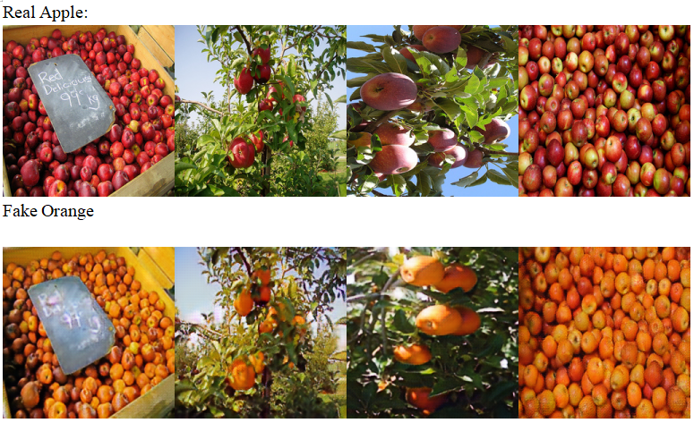
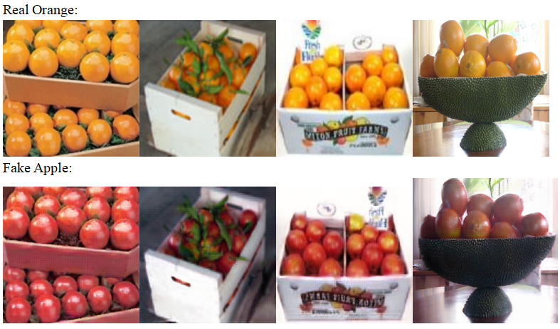
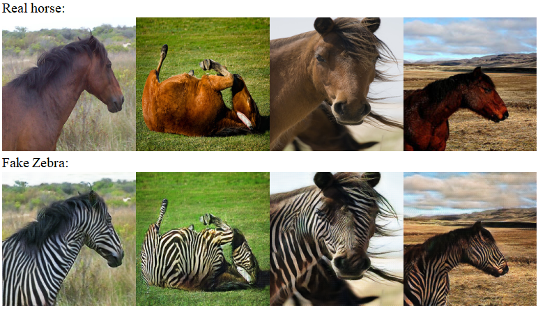
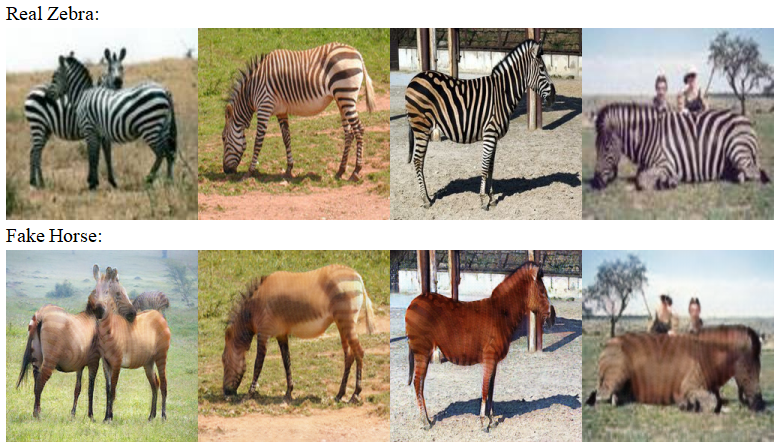
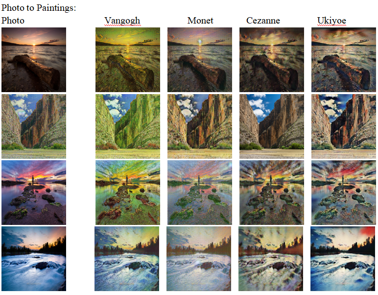
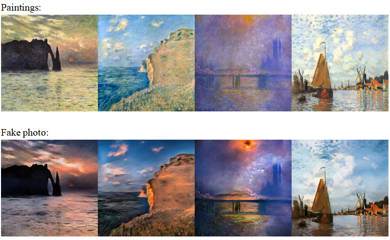

# csci1470_final

Reimplementation of CycleGAN in Pytorch.

## Results:

|Convert apple to orange:|
||
||
|Convert orange to apple:|
||
|Convert horse to zebra:|
||
|Convert zebra to horse:|
||
|Convert photo to painting|
||
|Convert painting to photo|
||
